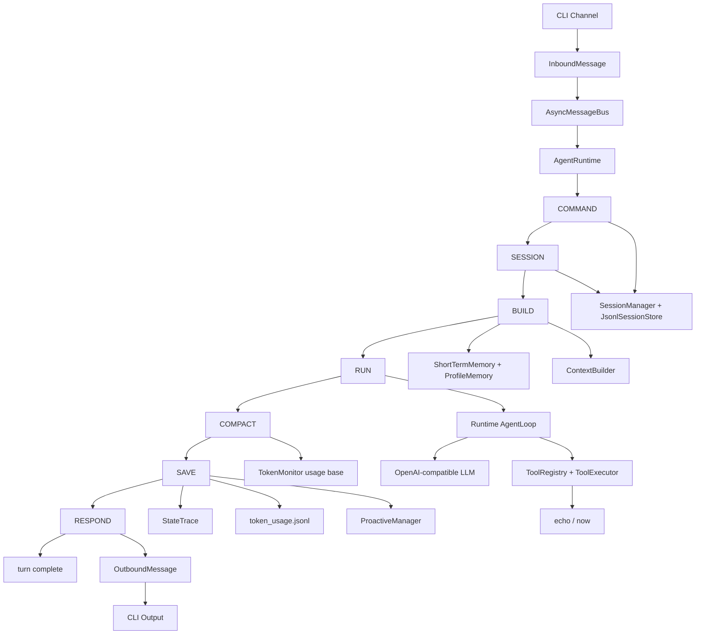

# Turning-Good-Agent

轻量 Runtime-first 通用 Agent MVP。

## 运行

```bash
python -m Turning-Good-Agent chat
```

## 交互命令

```text
/history
/context
/new
/clear
/exit
```

当前默认使用 OpenAI-compatible Provider，需要在 `settings.local.json` 中配置真实模型。

## 配置

核心参数集中在 `Turning-Good-Agent/config/settings.py`。

```text
RuntimeSettings  Runtime 执行限制
MemorySettings   短期记忆压缩阈值
SessionSettings  会话保留期
LLMSettings      LLM Provider 配置
```

短期记忆默认策略：

```text
compact_token_threshold = 200000
recent_window_token_limit = 20000
max_context_tokens = 300000
```

当上次压缩后新增的原文历史超过 `200000` token 时触发压缩；压缩后只保留最近不超过 `20000` token 的完整 user/assistant 对话原文，其余旧消息通过 LLM 生成新的 `summary`。摘要 LLM 调用必须返回真实 usage，并合并进发生压缩的本轮 `token_usage.jsonl`；若摘要缺少 usage 或为空，本轮按失败处理。`BUILD` 默认注入 `summary + uncompacted_history`，最终注入模型的上下文受 `max_context_tokens = 300000` 约束；上下文预算直接按 `ContextBuilder.build()` 生成的真实消息列表计算，包含 `SYSTEM_PROMPT`、长期偏好、工具 schema、summary、未压缩历史和当前用户输入；若本轮构建时仍超过该上限，先拒绝本轮并提示上下文过大。

推荐使用根目录下的 `settings.local.json` 进行本地永久配置。这个文件不会被提交到 GitHub。

可以从 `settings.example.json` 复制一份：

```bash
cp settings.example.json settings.local.json
```

然后修改其中的 `llm`、`memory`、`runtime`、`sessions` 配置。

运行时数据默认保存在：

```text
.sessions/<北京时间>_<session_id>/
```

每个 session 目录下独立保存：

```text
session.json
messages.jsonl
turn_traces.jsonl
token_usage.jsonl
```

会话生命周期规则：

```text
1. /new 只切换到新会话，不落空会话目录
2. /clear 会直接删除当前会话目录
3. 会话默认保留 7 天，超期目录会在后续会话请求前被清理
```

## 整体架构



核心路径：

```text
CLI 输入
-> Runtime: COMMAND -> SESSION -> BUILD -> RUN -> COMPACT -> SAVE -> RESPOND
-> OutboundMessage
-> CLI 输出
```

模块边界：

```text
runtime/      状态机、Runtime、AgentLoop
sessions/     会话、消息、JSONL 持久化、会话锁
context/      system prompt、summary、uncompacted history、tool schema 组装
memory/       短期记忆压缩骨架、长期偏好骨架、事件记忆骨架
tools/        工具抽象、注册、执行、内置工具
llm/          LLM Provider 抽象和 OpenAI-compatible 实现
observability trace 和 token 记录
proactive/    主动能力扩展入口
```

## 当前阶段

项目当前处于 Phase 2：真实 LLM SDK 化、Tool Calling 与 CLI 流式输出。

已完成：

```text
OpenAI Python SDK 接入
openai-compatible 统一接入族
基础 tool calling 工作消息回注
请求失败错误回显
可恢复 LLM 错误重试
```

下一步：

```text
tools 参数归一化和 JSON Schema 校验
ToolRegistry.prepare_call()
ToolLoader 自动加载内置工具
工具 schema 稳定排序
CLI 文本流式输出开关
tool call observability 单独落盘
```

工具系统会继续保持轻量，不引入完整插件生态。当前阶段只做内置工具自动加载；MCP tools 会在 Phase 3 通过 adapter 注册进同一个 `ToolRegistry`。

## 使用真实 LLM 测试

当前使用 OpenAI-compatible Provider。真实 LLM 接入已经迁移到 OpenAI Python SDK，并支持基础 tool calling。

在 `settings.local.json` 中填写：

```json
{
  "llm": {
    "provider": "openai-compatible",
    "api_key": "你的 API Key",
    "base_url": "https://api.openai.com/v1",
    "model": "你的模型名"
  }
}
```

如果你接的是 DeepSeek、Qwen 这类兼容 OpenAI Chat Completions 协议的服务，`provider` 仍然统一写成 `openai-compatible`，只替换 `base_url`、`model` 和 `api_key`。

运行：

```bash
python -m Turning-Good-Agent chat
```

当前真实 LLM 已使用 OpenAI Python SDK 的异步 client，也就是 `AsyncOpenAI().chat.completions.create(...)`，并在 `AgentLoop` 中补齐 assistant tool_call 消息和 tool result 消息。后续仍需要把 tool call 结果单独落盘到更清晰的 observability 结构中。

流式输出通过集中配置显式开启：

```json
{
  "llm": {
    "streaming_enabled": true
  }
}
```

默认值是 `true`。CLI 会逐段打印模型返回的文本；如果模型返回 tool call 参数片段，LLM 层会先合并成完整工具调用，再交给现有 AgentLoop 执行。Web、微信、飞书的流式展示后续在 channel 阶段接入。

当前 LLM 接入还有两个硬约束：

- provider 必须返回真实 `usage`；无论是非流式还是流式，只要最终缺少有效 `usage`，本轮都会失败，且不会写入 `token_usage.jsonl`。
- tool call 必须完整且参数是合法 JSON object；如果缺少 `tool_call.id`、`function.name`，或参数 JSON 非法，会直接返回错误，不再静默降级成空参数。
