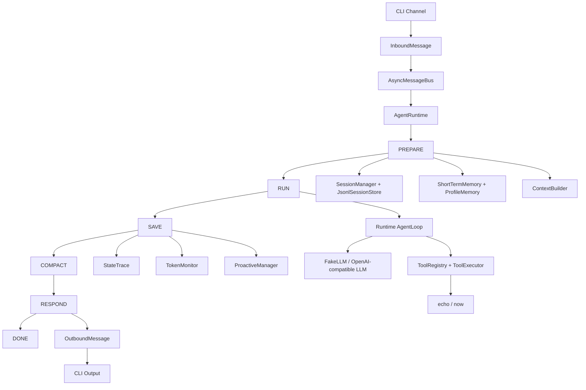

# Turning-Good-Agent

轻量 Runtime-first 通用 Agent MVP。

## 运行

```bash
python -m Turning-Good-Agent chat
```

## 交互命令

```text
/history
/new
/clear
/exit
```

默认使用 FakeLLM，不需要 API key。

## 配置

核心参数集中在 `Turning-Good-Agent/config/settings.py`。

```text
RuntimeSettings  Runtime 执行限制
MemorySettings   短期记忆压缩阈值
SessionSettings  会话保留期
LLMSettings      LLM Provider 配置
```

短期记忆默认策略：

```text
compact_token_threshold = 200000
raw_window_token_limit = 20000
```

当上次压缩后新增的原文历史超过 `200000` token 时触发压缩；压缩后只保留最近不超过 `20000` token 的完整 user/assistant 对话原文，其余旧消息进入 `summary`。

推荐使用根目录下的 `settings.local.json` 进行本地永久配置。这个文件不会被提交到 GitHub。

可以从 `settings.example.json` 复制一份：

```bash
cp settings.example.json settings.local.json
```

然后修改其中的 `llm`、`memory`、`runtime`、`sessions` 配置。

运行时数据默认保存在：

```text
data/sessions/<UTC时间>_<session_id>/
```

每个 session 目录下独立保存：

```text
session.json
messages.jsonl
turn_traces.jsonl
token_usage.jsonl
```

会话生命周期规则：

```text
1. /new 只切换到新会话，不落空会话目录
2. /clear 会直接删除当前会话目录
3. 会话默认保留 7 天，超期目录会在后续会话请求前被清理
```

## 整体架构



核心路径：

```text
CLI 输入
-> Runtime: PREPARE -> RUN -> SAVE -> COMPACT -> RESPOND -> DONE
-> OutboundMessage
-> CLI 输出
```

模块边界：

```text
runtime/      状态机、Runtime、AgentLoop
sessions/     会话、消息、JSONL 持久化、会话锁
context/      system prompt、history、summary、tool schema 组装
memory/       短期记忆压缩骨架、长期偏好骨架、事件记忆骨架
tools/        工具抽象、注册、执行、内置工具
llm/          LLM Provider 抽象和 FakeLLM
observability trace 和 token 记录
proactive/    主动能力扩展入口
```

## 使用真实 LLM 测试

默认仍使用 `FakeLLM`，不需要 API key。要访问真实模型，使用 OpenAI-compatible Provider：

在 `settings.local.json` 中填写：

```json
{
  "llm": {
    "provider": "openai-compatible",
    "api_key": "你的 API Key",
    "base_url": "https://api.openai.com/v1",
    "model": "你的模型名"
  }
}
```

运行：

```bash
python -m Turning-Good-Agent chat
```

当前真实 LLM 只启用纯文本对话，暂不启用真实模型 tool calling。后续再把 `ToolRegistry.schemas()` 转成模型要求的 tool schema，并在 `AgentLoop` 中补齐 assistant tool_call 消息和 tool result 消息。
