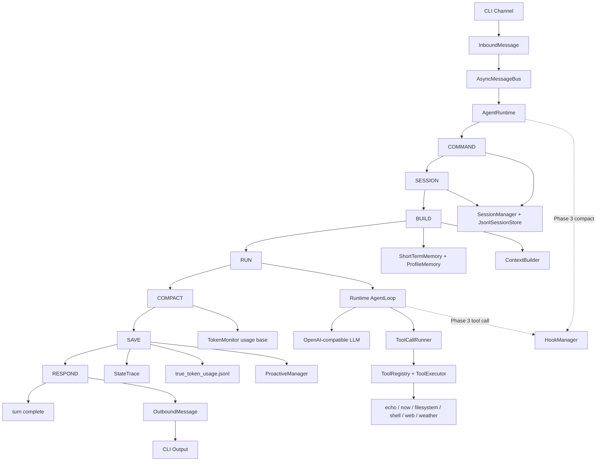

# Turning-Good-Agent

轻量 Runtime-first 通用 Agent MVP。

## 运行

```bash
python -m Turning-Good-Agent chat
```

## 交互命令

```text
/history
/context
/tools
/approve [on|off]
/new
/clear
/exit
```

当前默认使用 OpenAI-compatible Provider，需要在 `settings.local.json` 中配置真实模型。

## 配置

核心参数集中在 `Turning-Good-Agent/config/settings.py`。

```text
RuntimeSettings  Runtime 执行限制
MemorySettings   短期记忆压缩阈值
SessionSettings  会话保留期
ToolPermissionSettings 审批类工具列表
LLMSettings      LLM Provider 配置
McpSettings      MCP Server 与附件限制配置
```

短期记忆默认策略：

```text
compact_token_threshold = 200000
recent_window_token_limit = 20000
max_context_tokens = 300000
```

当上次压缩后新增的原文历史超过 `200000` token 时触发压缩；压缩后只保留最近不超过 `20000` token 的完整 user/assistant 对话原文，其余旧消息通过 LLM 生成新的 `summary`。摘要 LLM 调用必须返回真实 usage，并合并进发生压缩的本轮 `true_token_usage.jsonl`；若摘要缺少 usage 或为空，本轮按失败处理。`BUILD` 默认注入 `summary + uncompacted_history`，最终模型上下文受 `max_context_tokens = 300000` 约束；工具 schema 只经 OpenAI-compatible 请求的 `tools` 参数发送，不会重复写入 system message，预算只计算一次实际发送的 schema 序列化内容；若本轮构建时仍超过上限，先拒绝本轮并提示上下文过大。

当前配置只从根目录下的 `settings.local.json` 读取。这个文件不会被提交到 GitHub，也不再支持 `TGA_*` 环境变量覆盖。

可以从 `settings.example.json` 复制一份：

```bash
cp settings.example.json settings.local.json
```

然后修改其中的 `llm`、`memory`、`runtime`、`sessions` 配置。

运行时数据默认保存在：

```text
.sessions/<北京时间>_<session_id>/
```

每个 session 目录下独立保存：

```text
session.json
messages.jsonl
turn_traces.jsonl
true_token_usage.jsonl
tool_calls.jsonl
```

会话生命周期规则：

```text
1. /new 只切换到新会话，不落空会话目录
2. /clear 会直接删除当前会话目录
3. 会话默认保留 7 天，超期目录会在后续会话请求前被清理
4. `auto_approve_tools` 保存在当前会话的 `session.json`，新会话默认关闭
```

## 整体架构



核心路径：

```text
CLI 输入
-> Runtime: COMMAND -> SESSION -> BUILD -> RUN -> COMPACT -> SAVE -> RESPOND
-> OutboundMessage
-> CLI 输出
```

模块边界：

```text
runtime/      状态机、Runtime、AgentLoop
sessions/     会话、消息、JSONL 持久化、会话锁
context/      system prompt、summary、uncompacted history 组装和 token 预算
memory/       短期记忆压缩骨架、长期偏好骨架、事件记忆骨架
tools/        工具抽象、注册、执行、当前轮附件、内置工具
llm/          LLM Provider 抽象和 OpenAI-compatible 实现
hooks/        会话工具权限、工具结果截断、跨 Channel 状态提示
observability trace 和 token 记录
proactive/    主动能力扩展入口
```

## 当前阶段

项目当前已完成 Phase 3 四项轻量 Hook 能力，以及 Phase 4 MCP Client 与审批/Runtime 收口：会话工具权限、工具结果截断、跨 Channel 状态提示、只读 Turn Monitor、MCP Catalog、显式远端 Tool、当前轮附件和最终资源关闭。

已完成：

```text
OpenAI Python SDK 接入
openai-compatible 统一接入族
基础 tool calling 工作消息回注
tools 参数归一化和 JSON Schema 校验
ToolRegistry.prepare_call()
ToolLoader 自动加载内置工具，并隔离单个坏工具模块
工具 schema 稳定排序和缓存
CLI 文本流式输出开关
RUN trace 中记录 tool_call_count 和 tool_names
tool_calls.jsonl 工具调用明细落盘
/tools 会话工具记录查看命令
工具轮数上限触发一次 no-tools 总结，并隔离 DSML 协议泄漏
ToolCallRunner 收口参数规范化、审批、并发、双重安全检查和结果 Hook
ContextAttachment 仅进入当前 AgentLoop working messages
MCP Client：stdio / Streamable HTTP、Catalog、显式 enabled_tools 和 list_changed 刷新
请求失败错误回显
可恢复 LLM 错误重试
文件基础工具：list_dir / find_file / read_file / write_file / edit_file / grep
受限命令工具：exec / write_stdin
网络与信息工具：web_search / web_fetch / weather，其中 web_search 使用 Yahoo Search
```

Phase 2 保留边界：

```text
tool call / tool result 不作为独立消息写入 messages.jsonl
tool call 明细写入 tool_calls.jsonl，但不作为独立对话消息进入 messages.jsonl
Web、微信、飞书的流式展示后续在 channel 阶段接入
MCP tools、skills tools、entry_points 插件不属于 Phase 2
```

工具系统继续保持轻量，不引入完整插件生态。Phase 3 已完成 Hooks Runtime Extension；Phase 4 支持通过官方 MCP Python SDK 连接 stdio 与 Streamable HTTP Server。默认只发现 MCP Catalog，不向模型注册远端 Tool；在 `settings.local.json` 的 `mcp.servers.<name>.enabled_tools` 中显式列出的 Tool 才以 `mcp_<server>_<tool>` 注册。所有远端 MCP Tool 和 Resource/Prompt 附件默认逐次审批，只有当前会话 `/approve on` 可统一跳过确认；MCP annotations 只保留为 metadata，不参与策略。HTTP Server 默认要求 HTTPS，仅 localhost、127.0.0.1、::1 可使用 HTTP。旧 HTTP+SSE、OAuth、浏览器授权、sampling 与跨轮附件均不支持。

Phase 3 实现四项轻量 Hook 能力：`ToolPermissionHook` 对已标记审批的内置工具、MCP Tool 与 MCP 附件读取当前 session 的 `auto_approve_tools`；关闭时由当前 `ChannelAdapter` 请求确认，CLI 使用 `y/N`，未支持审批的 Channel 确定性拒绝。`/approve` 查看状态，`/approve on` 是唯一自动放行开关，`/approve off` 恢复逐次审批；MCP Server 不支持单独配置自动审批。自动审批只跳过人工确认，不能绕过 `security.py` 和 `ToolExecutor` 的二次预检；审批请求本身不持久化，也不包含跨 Channel、超时或恢复机制。工具结果在注入 LLM 前按 `max_tool_result_tokens = 8000` 截断；通用 `ChannelStatusHook` 在工具开始、完成和真实压缩前后发送状态。`TurnMonitorHook` 在可持久化模型会话结束后，将 outcome、总耗时、锁等待和失败工具数写入 `RESPOND.metadata`，不新增监控 JSONL。Runtime 按 `InboundMessage.channel` 通过 `ChannelRouter` 创建单轮 `ChannelAdapter`，CLI 已显示流式文本、按调用 ID 区分的并行工具动画与状态；Web 可注册适配器，微信和飞书当前静默且尚未接入传输层。连续的并行安全工具可通过 `parallel_tool_calls_enabled` 配置并发执行，审批类工具在启动时强制校验为非并行。

审批类工具可在 `settings.local.json` 中集中配置：

```json
{
  "tool_permissions": {
    "approval_required_tools": [
      "write_file",
      "edit_file",
      "exec",
      "write_stdin"
    ]
  }
}
```

开启并行安全工具调用：

```json
{
  "runtime": {
    "parallel_tool_calls_enabled": true,
    "max_parallel_tool_calls": 4
  }
}
```

## 使用真实 LLM 测试

当前使用 OpenAI-compatible Provider。真实 LLM 接入已经迁移到 OpenAI Python SDK，并支持基础 tool calling。

在 `settings.local.json` 中填写：

```json
{
  "llm": {
    "provider": "openai-compatible",
    "api_key": "你的 API Key",
    "base_url": "https://api.openai.com/v1",
    "model": "你的模型名"
  }
}
```

如果你接的是 DeepSeek、Qwen 这类兼容 OpenAI Chat Completions 协议的服务，`provider` 仍然统一写成 `openai-compatible`，只替换 `base_url`、`model` 和 `api_key`。

运行：

```bash
python -m Turning-Good-Agent chat
```

当前真实 LLM 已使用 OpenAI Python SDK 的异步 client，也就是 `AsyncOpenAI().chat.completions.create(...)`，并在 `AgentLoop` 中补齐 assistant tool_call 消息和 tool result 消息。工具调用精简明细会在 `SAVE` 状态统一写入 `tool_calls.jsonl`，`/tools` 可直接查看当前会话的调用记录。

当工具循环达到 `max_tool_rounds` 时，AgentLoop 会基于已有 tool result 发起一次禁用 tools 的最终总结请求。最终请求若返回自然语言，则直接作为本轮回答；若 provider 返回 DSML 工具调用格式、继续返回 tool call 或空文本，则不展示原始内容，改为提示已完成工具次数并引导用户使用 `/tools` 查看完整记录。

流式输出通过集中配置显式开启：

```json
{
  "llm": {
    "streaming_enabled": true
  }
}
```

默认值是 `true`。Runtime 将模型文本 delta 交给当前 Channel 的输出实现；CLI 会逐段打印，未注册的 Channel 忽略中间文本但仍返回最终 `OutboundMessage`。如果模型返回 tool call 参数片段，LLM 层会先合并成完整工具调用，再交给现有 AgentLoop 执行。Web、微信、飞书的实际传输适配仍在后续 channel 阶段接入。

当前 LLM 接入还有两个硬约束：

- provider 必须返回真实 `usage`；无论是非流式还是流式，只要最终缺少有效 `usage`，本轮都会失败，且不会写入 `true_token_usage.jsonl`。
- tool call 必须完整且参数是合法 JSON object；如果缺少 `tool_call.id`、`function.name`，或参数 JSON 非法，会直接返回错误，不再静默降级成空参数。

`SAVE.metadata` 会在本轮结束后记录上下文 token 观测，不包含 tool result：

```text
system_tokens
profile_memory_tokens
summary_tokens
history_tokens
current_input_tokens
output_tokens
tool_schema_tokens
tool_count
current_context_tokens
```

其中 `history_tokens` 是本轮之前未压缩历史的 token，`current_input_tokens` 和 `output_tokens` 分别记录本轮用户输入和助手输出。只有本轮完整 user/assistant 仍保留在 `uncompacted_history` 时，它们才计入 `current_context_tokens`；如果本轮已经被压缩进 summary，就只通过 `summary_tokens` 体现。`tool_count` 是本轮实际工具调用次数，`current_context_tokens` 是本轮结束后的当前上下文 token 数，字段放在最后便于人工查看。
