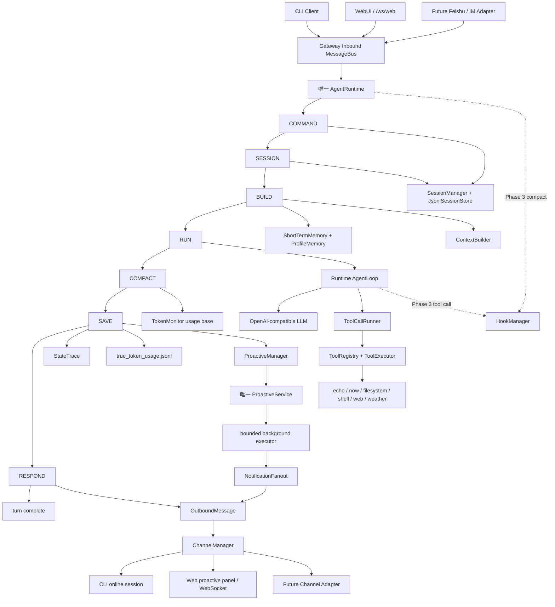

# Turning-Good-Agent

轻量 Runtime-first 通用 Agent MVP。

## 运行

```bash
# 唯一 Runtime/Bus/Proactive Host，同时提供本机 Web 工作台
python -m Turning-Good-Agent gateway

# 另一个终端：连接 Gateway 的默认 CLI 会话
python -m Turning-Good-Agent chat
```

`tga gateway` 与 `tga chat` 是对应的命令形式。CLI 默认连接 conversation `default`；需要命名会话时使用可选的 `--session <name>`。先启动 Gateway，再打开 `http://localhost:8000` 或启动 CLI Client。`tga web` 已移除；Web 不再单独创建 Runtime。

## Docker 本机部署

需要 Windows 上启用了 WSL 2 后端的 Docker Desktop。容器只发布到本机回环地址，因此仅能通过 `http://localhost:8000` 访问，局域网设备无法连接。

首次运行时，先创建本地配置并填写真实的 `llm.api_key` 与 `llm.model`：

```powershell
Copy-Item settings.example.json settings.local.json
```

然后构建并启动服务：

```powershell
docker compose up --build -d
Start-Process http://localhost:8000
```

查看运行日志：

```powershell
docker compose logs -f
```

停止并移除容器：

```powershell
docker compose down
```

会话数据保存在 Docker 命名卷中，执行 `docker compose down` 后仍会保留。执行下面命令会永久删除会话数据：

```powershell
docker compose down -v
```

容器服务入口是唯一 Gateway。`settings.local.json` 不会写入镜像，也不会提交到 Git；Web 工作台的自动批准设置会写回此文件，Gateway 首次启动还会在其中生成本机 CLI Bearer 凭据 `gateway.auth_token`，因此容器以可写方式挂载它。该 token 不是 Web 设置项，也不应复制到日志或聊天内容。

### Docker 开发模式与热更新

日常修改代码时，使用独立的开发配置：

```powershell
docker compose -f compose.dev.yaml up --build
```

打开 `http://localhost:8000`。修改 React、TypeScript 或 CSS 后，Vite 会自动更新页面；修改 Python 后，Uvicorn 会自动重启后端，刷新网页即可连接到新版本。按 `Ctrl+C` 停止前台开发服务，或另开 PowerShell 执行：

```powershell
docker compose -f compose.dev.yaml down
```

### 在 Docker 中运行 CLI

CLI 是 Gateway Client，必须连接已经运行的同一 Gateway，不能再用 `--no-deps` 创建一个没有 Gateway 的临时 CLI 容器。开发时先启动并复用同一个后端容器，再在其中启动 CLI：

```powershell
docker compose -f compose.dev.yaml up -d --build backend
docker compose -f compose.dev.yaml exec -it backend python -u -m Turning-Good-Agent chat --session main
```

生产 Compose 则使用运行中的 `turning-good-agent` 服务执行同一条 `chat --session` 命令。代码通过挂载目录实时生效；修改 Python 源码通常不需要重新构建。修改 `Dockerfile` 或 Python 依赖后，重新执行 `up -d --build backend`。不要使用 `docker compose down -v`，否则会删除会话和主动能力数据。

普通源码改动不需要重建镜像。修改 Python 依赖或 `Dockerfile` 后，重新执行带 `--build` 的启动命令。修改 `package.json` 或 `package-lock.json` 后，先停止开发服务并删除前端依赖卷，再重新启动；这不会删除会话数据：

```powershell
docker compose -f compose.dev.yaml down
docker volume rm turning-good-agent_frontend_node_modules
docker compose -f compose.dev.yaml up --build
```

开发模式同样只允许本机访问，且会话数据会保存在 Docker 命名卷中。

Web 默认使用石墨深色主题，可在右上角切换并记住浅色主题。工作台采用对话优先布局：会话栏独立滚动且可收起为品牌入口，左右侧栏共用响应式宽度；Radix 菜单与确认框处理会话操作，紧凑的图标操作菜单仅在命中项时提供阴影反馈。真实的工具、MCP、Skill、审批、压缩、Stop 与终态事件按 `request_id` 归入 user 与 assistant 消息之间的可折叠“思考中”活动簇；工具完成后回到“思考中”，不展示伪造的内部推理。输入区通过“默认权限 / 完全访问”菜单控制全局工具审批，发送按钮左侧的只读上下文圆环从最近一次 `SAVE` 的真实上下文统计和集中 `max_context_tokens` 计算，悬浮或键盘聚焦可查看读数。断线中的 Web turn 可在浏览器内重试，重试使用原动作标识避免重复入队；该即时状态和被替代旧消息的隐藏标记只存于浏览器标签页，不改变 Session JSON/JSONL 或 Runtime 上下文。会话检查器只汇总既有 token、trace 与工具记录，使用连续信息面展示摘要与分类，原始 JSON 只在单条记录中按需展开，不新增 JSONL。

检查器将状态 Trace 按会话轮次收拢；Token 账本使用“第 N 轮 · N Token”，压缩与上下文使用 `Compaction check`、`Save context`，状态 Trace 的长耗时使用 `s`、短耗时保留 `ms`。原始 `turn_id`、字段和 JSON 均保留在展开详情中；桌面端已在深浅主题、空状态、真实长会话、检查器、搜索与会话菜单下完成视觉验收。

## 交互命令

```text
/exit
/stop
```

`tga chat` 默认连接 conversation `default`；要使用命名会话，请以 `tga chat --session <name>` 连接。切换会话时结束当前 Client 后重新连接。CLI 只保留本地退出和停止命令；运行中 guidance 仅由 Web 提供，聊天与主动能力状态仍由 Gateway 统一处理。

当前默认使用 OpenAI-compatible Provider，需要在 `settings.local.json` 中配置真实模型。

## 配置

核心参数集中在 `Turning-Good-Agent/config/settings.py`。

```text
RuntimeSettings  Runtime 执行限制
MemorySettings   短期记忆压缩阈值
SessionSettings  会话保留期
ToolPermissionSettings 审批类工具与全局自动批准开关
WebSettings      Gateway 内 Web 工作台的并发和事件缓冲限制
GatewaySettings  本机 Gateway 监听、主体与 CLI 本机凭据
LLMSettings      LLM Provider 配置
McpSettings      MCP Server 与附件限制配置
SkillsSettings   本地 Skill Catalog 与当前轮加载限制
ProactiveSettings Gateway 共享主动能力、长期记忆与后台审阅限制
```

短期记忆默认策略：

```text
compact_token_threshold = 200000
recent_window_token_limit = 20000
max_context_tokens = 300000
```

当上次压缩后新增的原文历史超过 `200000` token 时触发压缩；压缩后只保留最近不超过 `20000` token 的完整 user/assistant 对话原文，其余旧消息通过 LLM 生成新的 `summary`。摘要 LLM 调用必须返回真实 usage，并合并进发生压缩的本轮 `true_token_usage.jsonl`；若摘要缺少 usage 或为空，本轮按失败处理。`BUILD` 默认注入 `summary + uncompacted_history`，最终模型上下文受 `max_context_tokens = 300000` 约束；工具 schema 只经 OpenAI-compatible 请求的 `tools` 参数发送，不会重复写入 system message，预算只计算一次实际发送的 schema 序列化内容；若本轮构建时仍超过上限，先拒绝本轮并提示上下文过大。

当前配置只从根目录下的 `settings.local.json` 读取。这个文件不会被提交到 GitHub，也不再支持 `TGA_*` 环境变量覆盖。

可以从 `settings.example.json` 复制一份：

```bash
cp settings.example.json settings.local.json
```

然后修改其中的 `llm`、`memory`、`runtime`、`sessions`、`gateway`、`proactive` 配置。`gateway.auth_token` 留空即可：Gateway 首次启动会安全地在本地文件生成它，Web 设置页不显示或编辑该字段。

`proactive` 默认启用，使用 `Asia/Shanghai` 时区、Breakbeat 每 60 分钟、Dream 每 24 小时、Skill 沉淀每天一次。`review_provider`、`review_api_key`、`review_base_url`、`review_model` 必须全空或全部填写；全空时复用主 LLM，完整填写时可以使用另一家兼容服务。

`now` Tool 使用同一个 `proactive.timezone` 返回带 IANA 时区、UTC offset 和 UTC 对照的当前时间。Cron 的周期任务保存 cron 表达式，一次性任务保存确定性的带 offset `next_run_at`（也可由 `delay_seconds` 计算）；修改全局时区后只会重算周期任务的未来触发时间。`delivery_channels` 仅保留为现有 Cron 快照兼容字段，结果通知统一按 Gateway 的 `all_subscribed` Fanout 决定。`delete_cron` 与 `delete_breakbeat` 都会硬删除目标及其全部历史记录，不保留软删除状态。

Breakbeat 事项只保存 `todo`、可空 `deadline`、由代码填写的 `source_session_id`，状态仅为 `in_progress` 或 `completed`；用户可用 `complete_breakbeat` 明确完成。Dream 只进行单阶段审阅，并直接追加到全局 `memory/USER.md` 或 `memory/SOUL.md`，不保存 Evidence、中间 registry 或 revision。`list_incidents` 从规则产生的 durable 记录列出 `open`/`resolved` 异常，不调用 LLM。

运行时数据默认保存在：

```text
.sessions/<北京时间>_<session_id>/
```

每个 session 目录下独立保存：

```text
session.json
messages.jsonl
turn_traces.jsonl
true_token_usage.jsonl
tool_calls.jsonl
```

Phase 7 还在同一 `data_dir` 下使用独立目录，绝不改写上述会话事实：

```text
.sessions/
  memory/
    USER.md
    SOUL.md
  proactive/
    cron.json
    breakbeat.json
    dream.json
    skill.json
    incidents.json
```

`USER.md` 与 `SOUL.md` 是受总 16,000 token 限制的长期画像。主动状态只保存恢复业务所需的最新 JSON 快照和累计 usage，不保存执行审计 JSONL；主动结果也不会进入 `messages.jsonl`、summary、trace、token 或 tool-call 文件。若目录中已有旧版 `pending_deliveries.json`，Gateway 会保留其字节不变且不读取、迁移、删除或使用它。

手动运行 `run_breakbeat` 或 `run_dream` 时必须选择本次范围：`scope="session"` 只审阅当前会话，`scope="global"` 审阅所有未归档会话。触发 Tool 的当前用户消息虽然尚未进入 `messages.jsonl`，仍会以同一个消息 ID 和时间临时加入本次审阅；正常 SAVE 后不会重复处理。后台周期运行固定使用全局范围。`read_profile_memory` 可直接读取当前 `USER.md` 与 `SOUL.md`；`run_dream` 会返回本次实际追加的 target/content，而不是只返回通用完成提示。

Gateway 的自动后台任务、Cron 和 Incident 只执行一次，再由在线 `NotificationFanout` 立即定向通知。Web 结果进入 `#proactive` 主动概览或对应领域页，并显示可点击导航的短暂顶部居中提示；CLI 只在 `tga chat` 在线期间接收即时结果，结果产生时若已切换会话则投递到当前在线会话。离线或未知 Channel 会被跳过，不重试、不补发；所有主动通知都不写入聊天历史。

Gateway 重构不迁移、备份、恢复或自动删除旧主动状态或画像，也不提供迁移脚本。已确认的切换以清空历史持久化内容和画像开始；Gateway 本身不会在运行时悄悄删除数据。启动 Gateway 前必须停止旧 CLI/Web Host；新 `<data_dir>/gateway.lock` 不与旧 `proactive/.owner.json` 或 `.owner.lock` 互斥，也不会自动清理它们。

会话过期清理只删除含有效 `session.json` 且确实超过保留期的会话目录。`memory/`、`proactive/`、其他未知目录以及元数据损坏的目录均不会被清理逻辑删除，因此新开 CLI 会话不会再导致 Cron、Breakbeat 或画像丢失。

会话生命周期规则：

```text
1. /new 只切换到新会话，不落空会话目录
2. /clear 会直接删除当前会话目录
3. 会话默认保留 7 天，超期目录会在后续会话请求前被清理
4. 清理只处理含有效 session.json 的真实会话目录，不处理 proactive、memory 或未知目录
5. 会话元数据保存标题、置顶和归档状态；自动批准是 `settings.local.json` 中的全局策略，默认关闭
```

## 整体架构


```mermaid
flowchart TD
    CLI[CLI Client] --> Inbound[Gateway Inbound MessageBus]
    WEB[WebUI / /ws/web] --> Inbound
    FUTURE[Future Feishu / IM Adapter] --> Inbound
    Inbound --> Runtime[唯一 AgentRuntime]

    Runtime --> Command[COMMAND]
    Command --> Session[SESSION]
    Session --> Build[BUILD]
    Build --> Run[RUN]
    Run --> Compact[COMPACT]
    Compact --> Save[SAVE]
    Save --> Respond[RESPOND]
    Respond --> End[turn complete]

    Command --> SessionStore[SessionManager + JsonlSessionStore]
    Session --> SessionStore
    Build --> Memory[ShortTermMemory + ProfileMemory]
    Build --> Context[ContextBuilder]

    Run --> AgentLoop[Runtime AgentLoop]
    AgentLoop --> LLM[OpenAI-compatible LLM]
    AgentLoop --> ToolRunner[ToolCallRunner]
    ToolRunner --> Tools[ToolRegistry + ToolExecutor]
    Tools --> Builtins[echo / now / filesystem / shell / web / weather]

    Runtime -. Phase 3 compact .-> Hooks[HookManager]
    AgentLoop -. Phase 3 tool call .-> Hooks

    Compact --> Token[TokenMonitor usage base]
    Save --> Trace[StateTrace]
    Save --> TokenUsage[true_token_usage.jsonl]
    Save --> Proactive[ProactiveManager]
    Proactive --> ProactiveService[唯一 ProactiveService]
    ProactiveService --> Background[bounded background executor]
    Background --> Fanout[NotificationFanout]

    Respond --> Outbound[OutboundMessage]
    Fanout --> Outbound
    Outbound --> Manager[ChannelManager]
    Manager --> CLIOut[CLI online session]
    Manager --> WebOut[Web proactive panel / WebSocket]
    Manager --> FutureOut[Future Channel Adapter]
```

核心路径：

```text
CLI / Web / future Adapter 输入
-> Gateway Inbound MessageBus
-> 唯一 Runtime: COMMAND -> SESSION -> BUILD -> RUN -> COMPACT -> SAVE -> RESPOND
-> Gateway Outbound MessageBus -> ChannelManager
-> 定向 Channel 输出
```

模块边界：

```text
gateway/      唯一 Host、启动锁、规范路由、入站调度、RuntimeSupervisor
channels/     Channel 合约、ChannelManager、CLI/Web transport 与未来 Adapter 扩展点
runtime/      状态机、Runtime、AgentLoop
sessions/     会话、消息、JSONL 持久化、会话锁
context/      system prompt、summary、uncompacted history 组装和 token 预算
memory/       短期记忆压缩、USER.md/SOUL.md 长期记忆与完整注入
tools/        工具抽象、注册、执行、当前轮附件、内置工具
llm/          LLM Provider 抽象和 OpenAI-compatible 实现
hooks/        会话工具权限、工具结果截断、跨 Channel 状态提示
observability trace 和 token 记录
proactive/    Gateway 共享 Cron、Breakbeat、Dream、Skill Draft、Incident 与在线 Fanout
.skills/      项目根目录唯一的正式 Skill 与草稿目录
```

## 当前阶段

项目当前已完成 Phase 3 Hooks、Phase 4 MCP Client、Phase 5 Skills、Phase 6 本机 Web 工作台、Phase 7 主动能力与长期记忆，以及单 Gateway 多 Channel 核心装配；飞书实际 Adapter 尚未实施。

已完成：

```text
OpenAI Python SDK 接入
openai-compatible 统一接入族
基础 tool calling 工作消息回注
tools 参数归一化和 JSON Schema 校验
ToolRegistry.prepare_call()
ToolLoader 自动加载内置工具，并隔离单个坏工具模块
工具 schema 稳定排序和缓存
CLI 文本流式输出开关
RUN trace 中记录 tool_call_count 和 tool_names
tool_calls.jsonl 工具调用明细落盘
/tools 会话工具记录查看命令
工具轮数上限触发一次 no-tools 总结，并隔离 DSML 协议泄漏
ToolCallRunner 收口参数规范化、审批、并发、双重安全检查和结果 Hook
ContextAttachment 仅进入当前 AgentLoop working messages
MCP Client：stdio / Streamable HTTP、后台 Server Worker、Catalog、显式 enabled_tools、list_changed 刷新和连接级重试
Skills：启动扫描全量元数据、`load_skill` 当前轮完整加载、草稿创建/发布与受审批外部安装
Web：FastAPI + WebSocket、React 工作台、会话管理、运行中 guidance、Stop、审批与会话检查器
Gateway：唯一 Runtime/Bus/Proactive Host、CLI Client、Web 内置服务、规范会话路由与在线 Fanout
Phase 7：共享 Cron、Breakbeat、Dream、严格 Observation/Draft、系统 Incident、USER/SOUL 与不混入聊天历史的主动通知
请求失败错误回显
可恢复 LLM 错误重试
文件基础工具：list_dir / find_file / read_file / write_file / edit_file / grep
受限命令工具：exec / write_stdin
网络与信息工具：web_search / web_fetch / weather，其中 web_search 使用 Yahoo Search
```

Phase 2 保留边界：

```text
tool call / tool result 不作为独立消息写入 messages.jsonl
tool call 明细写入 tool_calls.jsonl，但不作为独立对话消息进入 messages.jsonl
Web 已支持实时展示；微信和飞书的流式展示仍在后续 channel 阶段接入
MCP tools、skills tools、entry_points 插件不属于 Phase 2
```

工具系统继续保持轻量，不引入完整插件生态。Phase 3 已完成 Hooks Runtime Extension；Phase 4 支持通过官方 MCP Python SDK 连接 stdio 与 Streamable HTTP Server。Gateway 的唯一 Runtime 启动时会为每个启用 Server 创建独立后台 Worker；CLI/Web/未来 Adapter 只复用该 Runtime 生命周期，正常会话不等待连接完成。连接级错误按每 Server 的 `connect_retry_attempts`、`connect_retry_delay_seconds`、`connect_retry_max_delay_seconds` 退避重试，权限、参数和 Tool 业务错误不重连。Client 依据 initialize capabilities 只发现 Server 已声明的 Catalog 类型，因此纯 Tool MCP Server 不必实现 Resource 或 Prompt 接口。默认只发现 MCP Catalog，不向模型注册远端 Tool；在 `settings.local.json` 的 `mcp.servers.<name>.enabled_tools` 中显式列出的 Tool 才以 `mcp_<server>_<tool>` 注册。所有远端 MCP Tool 和 Resource/Prompt 附件默认逐次审批，只有全局 `/approve on` 或 Web 自动批准开关可统一跳过确认；MCP annotations 只保留为 metadata，不参与策略。HTTP Server 默认要求 HTTPS，仅 localhost、127.0.0.1、::1 可使用 HTTP。旧 HTTP+SSE、OAuth、浏览器授权、sampling 与跨轮附件均不支持。

Phase 3 实现四项轻量 Hook 能力：`ToolPermissionHook` 对已标记审批的内置工具、MCP Tool 与 MCP 附件读取全局 `tool_permissions.auto_approve_tools`；关闭时由当前 `ChannelAdapter` 请求确认，CLI 使用 `y/N`，Web 使用单次审批卡。`/approve` 查看状态，`/approve on|off` 与 Web 输入区开关操作同一持久化策略；自动审批只跳过人工确认，不能绕过 `security.py` 和 `ToolExecutor` 的二次预检。工具结果在注入 LLM 前按 `max_tool_result_tokens = 8000` 截断；通用 `ChannelStatusHook` 在工具开始、完成和真实压缩前后发送状态。`TurnMonitorHook` 在可持久化模型会话结束后，将 outcome、总耗时、锁等待和失败工具数写入 `RESPOND.metadata`，不新增监控 JSONL。Gateway 按 `InboundMessage.route.channel` 通过 `ChannelRouter` 创建单轮 `ChannelAdapter`，再由共享 MessageBus 与 ChannelManager 定向投递；微信和飞书仍未接入传输层。连续的并行安全工具可通过 `parallel_tool_calls_enabled` 配置并发执行，审批类工具在启动时强制校验为非并行。

Phase 5 使用项目根目录唯一的 `.skills/`。`runtime.start()` 扫描正式目录，根 system prompt 每轮注入所有有效 Skill 的 `name + description`；`load_skill` 才会把完整 `SKILL.md` 以低优先级 system Attachment 放进当前 AgentLoop，下一轮不会重放，也不写入消息、摘要或额外 JSONL。内置 `skill-creator` 只在用户明确要求创建或修改 Skill 时加载，用于生成结构化草稿；内置 `skill-installer` 则在用户明确要求安装外部 Skill 时提供 HTTPS Git 安装、来源校验和后续加载的工作流；内置 `grilling` 仅在用户要求压力测试方案、决策或想法时逐题追问并在确认共识前不执行。`create_skill_draft`、`publish_skill_draft` 和 `install_skill` 都沿用现有 `y/N` 审批与 `/approve on`；安装只接受 HTTPS Git 仓库，在临时目录校验后发布，不执行下载内容。单轮最多加载 3 个，单个正文最多 8,000 tokens，正文总量最多 16,000 tokens；追加前还会校验实际 working messages 与 Tool schema 的 300k 上下文上限。MCP Attachment 仍严格仅允许 user/assistant role。`RUN.metadata` 记录实际加载的名称、数量与正文 token 数。

审批类工具可在 `settings.local.json` 中集中配置：

```json
{
  "tool_permissions": {
    "approval_required_tools": [
      "write_file",
      "edit_file",
      "exec",
      "write_stdin"
    ]
  }
}
```

开启并行安全工具调用：

```json
{
  "runtime": {
    "parallel_tool_calls_enabled": true,
    "max_parallel_tool_calls": 4
  }
}
```

## 使用真实 LLM 测试

当前使用 OpenAI-compatible Provider。真实 LLM 接入已经迁移到 OpenAI Python SDK，并支持基础 tool calling。

在 `settings.local.json` 中填写：

```json
{
  "llm": {
    "provider": "openai-compatible",
    "api_key": "你的 API Key",
    "base_url": "https://api.openai.com/v1",
    "model": "你的模型名"
  }
}
```

如果你接的是 DeepSeek、Qwen 这类兼容 OpenAI Chat Completions 协议的服务，`provider` 仍然统一写成 `openai-compatible`，只替换 `base_url`、`model` 和 `api_key`。

运行时先启动唯一 Gateway，再连接 CLI：

```bash
python -m Turning-Good-Agent gateway

# 另一个终端
python -m Turning-Good-Agent chat --session main
```

当前真实 LLM 已使用 OpenAI Python SDK 的异步 client，也就是 `AsyncOpenAI().chat.completions.create(...)`，并在 `AgentLoop` 中补齐 assistant tool_call 消息和 tool result 消息。工具调用精简明细会在 `SAVE` 状态统一写入 `tool_calls.jsonl`，`/tools` 可直接查看当前会话的调用记录。

当工具循环达到 `max_tool_rounds` 时，AgentLoop 会基于已有 tool result 发起一次禁用 tools 的最终总结请求。最终请求若返回自然语言，则直接作为本轮回答；若 provider 返回 DSML 工具调用格式、继续返回 tool call 或空文本，则不展示原始内容，改为提示已完成工具次数并引导用户使用 `/tools` 查看完整记录。

流式输出通过集中配置显式开启：

```json
{
  "llm": {
    "streaming_enabled": true
  }
}
```

默认值是 `true`。Runtime 将模型文本 delta 交给当前 Channel 的输出实现；CLI 会逐段打印，未注册的 Channel 忽略中间文本但仍返回最终 `OutboundMessage`。如果模型返回 tool call 参数片段，LLM 层会先合并成完整工具调用，再交给现有 AgentLoop 执行。Web 已支持实时传输；微信和飞书的实际传输适配仍在后续 channel 阶段接入。

当前 LLM 接入还有两个硬约束：

- provider 必须返回真实 `usage`；无论是非流式还是流式，只要最终缺少有效 `usage`，本轮都会失败，且不会写入 `true_token_usage.jsonl`。
- tool call 必须完整且参数是合法 JSON object；如果缺少 `tool_call.id`、`function.name`，或参数 JSON 非法，会直接返回错误，不再静默降级成空参数。

`SAVE.metadata` 会在本轮结束后记录上下文 token 观测，不包含 tool result：

```text
system_tokens
profile_memory_tokens
summary_tokens
history_tokens
current_input_tokens
output_tokens
tool_schema_tokens
tool_count
current_context_tokens
```

其中 `history_tokens` 是本轮之前未压缩历史的 token，`current_input_tokens` 和 `output_tokens` 分别记录本轮用户输入和助手输出。只有本轮完整 user/assistant 仍保留在 `uncompacted_history` 时，它们才计入 `current_context_tokens`；如果本轮已经被压缩进 summary，就只通过 `summary_tokens` 体现。`tool_count` 是本轮实际工具调用次数，`current_context_tokens` 是本轮结束后的当前上下文 token 数，字段放在最后便于人工查看。
