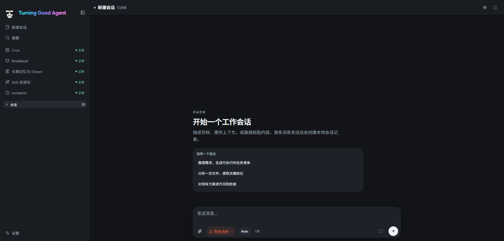
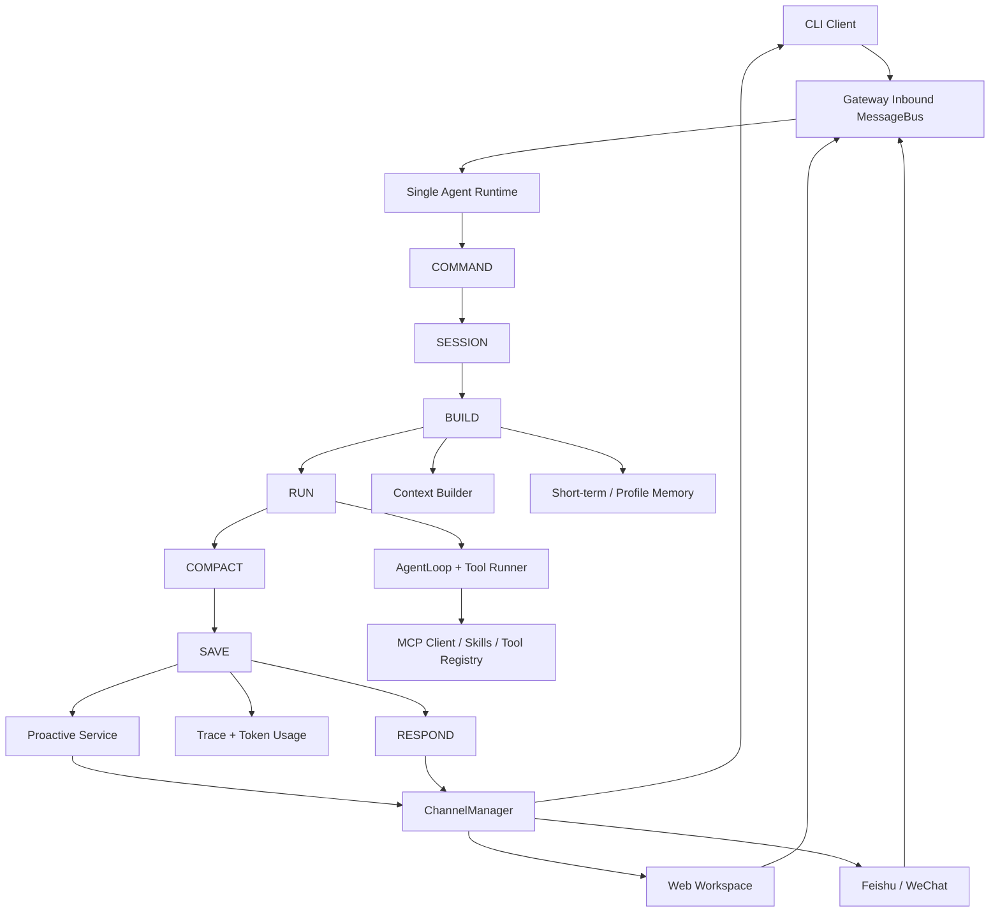

# Turning Good Agent

> 本地优先的通用 Agent Runtime：将会话、上下文、工具、主动能力与多智能体协作收敛到同一运行时，支持 CLI、Web、飞书和个人微信接入。



Turning Good Agent 面向希望持续扩展个人 Agent 的开发者。项目不以单一 Workflow 为中心，而是提供统一的 Gateway / Runtime / MessageBus 底座：不同 Channel 复用同一套会话、工具审批、状态持久化与可观测链路。

它重点处理长会话上下文膨胀、工具调用的权限边界、跨会话经验沉淀，以及可拆分复杂任务的协作执行。

## 特性与亮点

- **统一 Agent Runtime**：单 Gateway 承载 Runtime、MessageBus、主动任务与 Channel 管理；运行时按 `COMMAND -> SESSION -> BUILD -> RUN -> COMPACT -> SAVE -> RESPOND` 状态机完成一次请求。
- **上下文工程与成本可观测**：分层组装系统提示、长期画像、会话摘要、近期原文和当前输入；支持短期记忆压缩、工具结果截断，并记录真实 Token usage 与状态 Trace。
- **MCP 渐进披露**：支持 stdio 与 Streamable HTTP MCP Server；先发现 Catalog，再显式启用 Tool，Resource / Prompt 仅在当前轮按需挂载，避免无关 Schema 与附件污染上下文。
- **主动执行与 Skill 演进**：提供 Cron、Breakbeat、Dream、Incident 与 Skill Evolution；从历史会话沉淀待办、稳定偏好、任务经验和可复用工作流，并通过后台通知跟进跨会话事项。
- **受控 Multi-Agent 协作**：父 Agent 可按任务决定是否委派，支持并行 Fan-out / Fan-in 与顺序 Pipeline；Worker 使用独立上下文和只读工具配置，父 Agent 统一汇总结果并执行副作用。
- **多通道与本地部署**：CLI、Web、飞书和个人微信 Adapter 复用同一 Runtime；提供 Docker Compose 本机部署，默认仅监听 loopback 地址。

## 技术栈

| 领域 | 实现 |
| --- | --- |
| Runtime | Python 3.11+、状态机、MessageBus、JSONL Session Store |
| Agent 能力 | OpenAI-compatible Function Calling、Hooks、Skills、MCP Client |
| Context / Memory | 摘要压缩、USER / SOUL 长期画像、Token Usage Ledger |
| Multi-Agent | Fan-out / Fan-in、Pipeline、Worker Profile、并发与超时控制 |
| 接入与界面 | FastAPI、WebSocket、React、CLI、飞书 / 个人微信 Adapter |
| 工程化 | pytest、Docker Compose |

## 你可以用它做什么

- 使用 CLI 或 Web 运行同一个本地 Agent，并在会话间保留上下文、工具记录和 Token 账本。
- 接入 MCP Server，以按需发现和启用的方式调用外部 Tool、Resource 与 Prompt。
- 将周期任务、待办跟进、异常记录、画像更新与 Skill 草稿沉淀到后台主动能力中。
- 对可拆分任务开启 Multi-Agent 自动委派，由父 Agent 选择并行或顺序执行方式。
- 通过 Web 检查器查看会话状态、上下文占用、工具调用、Trace 与 Token 使用情况。

## 快速开始

### 1. 安装与配置

要求：Python 3.11+，以及一个 OpenAI Chat Completions 兼容的模型服务。

```powershell
git clone https://github.com/neystan/Turning-Good-Agent.git
Set-Location Turning-Good-Agent
python -m pip install -e .
Copy-Item settings.example.json settings.local.json
```

编辑 `settings.local.json`，至少填写 `llm.api_key`、`llm.base_url` 和 `llm.model`。该文件含本地密钥和 Gateway 凭据，不应提交到 Git。

如需开启多智能体，在配置中设置：

```json
{
  "multi_agent": {
    "enabled": true
  }
}
```

### 2. 启动 Gateway 与 Web 工作台

```powershell
python -m Turning-Good-Agent gateway
```

浏览器访问 [http://localhost:8000](http://localhost:8000)。Gateway 是唯一 Runtime Host，负责启动 Runtime、MessageBus、Web 与主动任务服务。

### 3. 连接 CLI

另开 PowerShell：

```powershell
python -m Turning-Good-Agent chat --session main
```

常用命令：

| 命令 | 作用 |
| --- | --- |
| `/stop` | 取消当前运行中的请求。 |
| `/approve on\|off` | 开启或关闭全局工具自动审批。 |
| `/multi auto\|off` | 本轮允许或关闭 Multi-Agent 自动委派。 |
| `/exit` | 退出 CLI Client，不停止 Gateway。 |

## 工作方式


```mermaid
flowchart TD
    CLI[CLI Client] --> IN[Gateway Inbound MessageBus]
    WEB[Web Workspace] --> IN
    IM[Feishu / WeChat] --> IN
    IN --> RT[Single Agent Runtime]

    RT --> COMMAND[COMMAND]
    COMMAND --> SESSION[SESSION]
    SESSION --> BUILD[BUILD]
    BUILD --> RUN[RUN]
    RUN --> COMPACT[COMPACT]
    COMPACT --> SAVE[SAVE]
    SAVE --> RESPOND[RESPOND]

    BUILD --> CTX[Context Builder]
    BUILD --> MEM[Short-term / Profile Memory]
    RUN --> LOOP[AgentLoop + Tool Runner]
    LOOP --> MCP[MCP Client / Skills / Tool Registry]
    SAVE --> OBS[Trace + Token Usage]
    SAVE --> PRO[Proactive Service]
    PRO --> OUT[ChannelManager]
    RESPOND --> OUT
    OUT --> CLI
    OUT --> WEB
    OUT --> IM
```

核心路径：

```text
CLI / Web / IM input
-> Gateway Inbound MessageBus
-> Agent Runtime: COMMAND -> SESSION -> BUILD -> RUN -> COMPACT -> SAVE -> RESPOND
-> Gateway Outbound MessageBus
-> ChannelManager -> target channel
```

## 关键能力

### Context、Memory 与 Token 控制

每轮由 Context Builder 组装系统提示、`USER.md` / `SOUL.md` 长期画像、历史摘要、近期原文和当前输入。旧会话在达到阈值后压缩为摘要，工具结果按上限截断；`SAVE` 阶段记录上下文构成、工具数量和真实 Token usage，便于追踪成本来源。

MCP 采用渐进披露：连接后仅发现 Server Catalog；远端 Tool 需在配置中显式启用，Resource / Prompt 由 Agent 在当前轮按需读取。附件有独立 Token 上限，不写入会话历史或摘要。

### 工具权限与受控执行

工具调用经过参数校验、审批、执行前二次检查与结果 Hook。默认需要审批的写操作包括 `write_file`、`edit_file`、`exec` 与 `write_stdin`；自动审批仅跳过交互确认，不能绕过路径和安全策略。

项目实现的是 Agent 工具层的受控执行，而非容器或虚拟机级沙箱。部署到不可信环境时，仍应在宿主机或基础设施层额外提供隔离。

### 主动执行与经验沉淀

Cron 保存周期或一次性任务；Breakbeat 管理持续待办；Dream 审阅历史会话并将稳定信息沉淀到长期画像；Incident 记录规则发现的异常；Skill Evolution 基于会话观察生成待审批的 Skill 草稿。主动结果通过在线 Channel 定向通知，不混入普通聊天历史。

### Multi-Agent Team Mode

当 `multi_agent.enabled=true` 且当前轮为 `auto` 时，父 Agent 可针对可拆分任务发起委派。支持两种拓扑：

- **Fan-out / Fan-in**：将相互独立的子任务并行分发，再由父 Agent 汇总。
- **Pipeline**：按依赖顺序串行传递结构化阶段结果。

Worker 不创建独立会话，不共享父 Agent 的工作上下文；其工具能力限制为只读 Profile。父 Agent 保留最终合成、审批与写入等副作用控制权。运行过程记录结构化状态、耗时与 Token 使用，支持超时取消和并发限制。

## 配置要点

所有本地配置位于根目录 `settings.local.json`，以 `settings.example.json` 为模板。常用配置包括：

| 区域 | 用途 |
| --- | --- |
| `llm` | OpenAI-compatible Provider、模型、密钥与流式输出。 |
| `runtime` | 工具轮数、单轮超时、上下文与工具结果 Token 上限。 |
| `memory` | 压缩阈值与近期原文保留窗口。 |
| `mcp` | Server、传输方式、显式启用 Tool 与附件上限。 |
| `skills` | 本地 Skill 目录与单轮加载上限。 |
| `proactive` | Cron / Dream / Breakbeat 等后台能力与长期画像预算。 |
| `multi_agent` | 委派开关、Worker 数量、超时、并发与结果预算。 |

运行数据默认保存于 `.sessions/`：每个会话保留 `messages.jsonl`、`turn_traces.jsonl`、`true_token_usage.jsonl` 与 `tool_calls.jsonl`；长期画像与主动任务使用独立目录，不改写普通会话事实。

## Docker 本机部署

要求：Docker Desktop 使用 WSL 2 后端。

```powershell
Copy-Item settings.example.json settings.local.json
# 编辑 settings.local.json 后启动
docker compose up --build -d
Start-Process http://localhost:8000
```

服务默认映射为 `127.0.0.1:8000:8000`，仅允许本机访问。会话数据保存在 Docker 命名卷中：

```powershell
docker compose logs -f
docker compose down
```

不要随意执行 `docker compose down -v`，该命令会删除持久化的会话和主动能力数据。

## 已实现范围与限制

已实现：Runtime 状态机、Function Calling、Tool Registry、Hooks、MCP Client、Skills、CLI / Web、飞书 / 个人微信 Adapter、主动能力与长期记忆、Multi-Agent Team Mode、Trace 与真实 Token usage 记录。

当前边界：

- 默认仅支持 OpenAI Chat Completions 兼容接口。
- MCP Client 支持 stdio 与 Streamable HTTP；不支持 OAuth、浏览器授权、HTTP+SSE 与跨轮附件。
- HTTP MCP Server 应使用 HTTPS；仅 `localhost`、`127.0.0.1` 和 `::1` 可使用 HTTP。
- Multi-Agent 在飞书和微信 Channel 中关闭；请在 CLI 或 Web 中使用。
- 本项目不提供容器级沙箱、多租户隔离或公网认证。公网部署前需自行配置认证、TLS、网络隔离与访问审计。

## 验证

```powershell
python -m pytest -q
```

## 许可证

本项目采用 MIT 许可证，详见 [LICENSE](LICENSE)。
