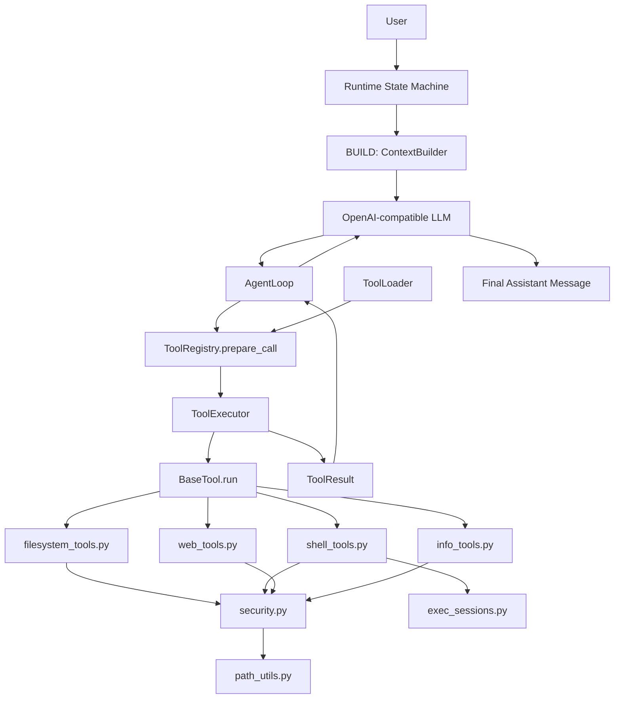

# Turning-Good-Agent Phase 2.5 基础工具扩展设计

**目标：** 在 Phase 2 已完成真实 LLM tool calling 主路径后，补齐轻量通用 agent 的基础工具面，让 CLI 真实对话可以完成文件查看、文件修改、内容搜索、受限命令执行、网页信息获取和天气查询。

**阶段定位：** Phase 2.5 是 Phase 2 和 Phase 3 之间的工具能力补强阶段。Phase 2 已解决“模型能稳定调用工具”，Phase 3 将做 MCP client。本阶段只做内置基础工具，不引入 MCP、skills、entry_points 插件或复杂浏览器自动化。

**当前状态：** 基础实现已开始，当前代码已新增 `filesystem_tools.py`、`shell_tools.py`、`web_tools.py`、`info_tools.py`、`security.py`、`path_utils.py` 和 `exec_sessions.py`。

**参考实现：** 本阶段参考 `/download/nanobot/nanobot/agent/tools`，重点借鉴其文件工具、搜索工具、shell 工具、长运行 exec session、路径限制和输出截断设计。但 TGA 保持更轻的 `BaseTool` / `ToolRegistry` / `ToolLoader` 结构，不迁移 nanobot 的完整 Schema 类体系和插件体系。

---

## 1. 工具清单

本阶段新增以下内置工具：

| 工具 | 模块 | 作用 |
| --- | --- | --- |
| `list_dir` | `filesystem_tools.py` | 列出目录内容，支持递归和最大返回数量。 |
| `find_file` | `filesystem_tools.py` | 按路径片段、glob、文件类型查找文件。 |
| `read_file` | `filesystem_tools.py` | 读取 UTF-8 文本文件，支持 offset/limit 分页。 |
| `write_file` | `filesystem_tools.py` | 创建新文件或整体覆盖写入。 |
| `edit_file` | `filesystem_tools.py` | 对已有文件做精确文本替换。 |
| `grep` | `filesystem_tools.py` | 在文件内容中搜索文本或正则。 |
| `exec` | `shell_tools.py` | 执行受限 shell 命令。 |
| `write_stdin` | `shell_tools.py` | 与 `exec` 创建的长运行命令会话交互。 |
| `web_search` | `web_tools.py` | 搜索网页，返回标题、摘要和 URL。 |
| `web_fetch` | `web_tools.py` | 抓取网页正文，返回截断后的纯文本。 |
| `weather` | `info_tools.py` | 查询指定城市天气。 |

已有工具继续保留：

| 工具 | 说明 |
| --- | --- |
| `echo` | 回显输入文本，用于基础 tool calling 验证。 |
| `now` | 返回当前本地时间。 |

---

## 2. `write_file` 与 `edit_file` 的边界

`write_file` 是整文件写入：

- 文件不存在时创建文件。
- 文件存在时整体覆盖。
- 适合生成新文档、新配置、新代码文件。
- 风险是可能覆盖已有内容，因此返回结果必须明确写入路径和字符数。

`edit_file` 是局部编辑：

- 文件必须存在。
- 通过 `old_text` 和 `new_text` 做精确替换。
- 默认要求 `old_text` 唯一匹配。
- 多处匹配时要求用户或模型提供更多上下文，或显式使用 `replace_all`。
- 适合小范围修改已有文件。

本阶段不实现复杂 AST 编辑，也不实现多文件 patch。后续如果需要批量编辑，再单独增加 `apply_patch`。

---

## 3. 工具目录设计

目标目录结构：

```text
Turning-Good-Agent/tools/
  base.py
  registry.py
  executor.py
  loader.py
  builtin_tools.py

  filesystem_tools.py
  shell_tools.py
  web_tools.py
  info_tools.py

  security.py
  path_utils.py
  exec_sessions.py
```

职责说明：

| 文件 | 职责 |
| --- | --- |
| `filesystem_tools.py` | 文件列表、文件查找、文件读取、文件写入、文本替换、内容搜索。 |
| `shell_tools.py` | 一次性命令执行和长运行命令交互。 |
| `web_tools.py` | 搜索和网页抓取。 |
| `info_tools.py` | 天气等结构化信息工具。 |
| `security.py` | 工具公共安全限制，不直接暴露给 LLM。 |
| `path_utils.py` | workspace 路径解析和路径包含关系判断。 |
| `exec_sessions.py` | 保存和管理 `exec` 启动的长运行子进程。 |

`grep` 放在 `filesystem_tools.py`，因为它的核心职责是文件内容搜索，和路径过滤、二进制跳过、文件大小限制共享同一套文件系统边界。

---

## 4. 架构图



调用路径：

```text
LLM tool_call
  -> AgentLoop
  -> ToolRegistry.prepare_call()
  -> ToolExecutor.execute()
  -> ConcreteTool.run()
  -> security/path/session helper
  -> ToolResult
  -> AgentLoop working messages
  -> LLM final answer
```

工具结果只进入本轮 `AgentLoop` working messages。是否把工具调用明细写入 `tool_calls.jsonl`，继续沿用 Phase 2 的观测机制，不把 tool result 作为独立会话消息写入 `messages.jsonl`。

---

## 5. 安全层设计

`security.py` 是公共安全层，不是一个可被模型调用的工具。

它负责：

- 统一截断过长输出。
- 统一限制文件读取大小。
- 统一限制网页响应大小。
- 统一检查危险命令。
- 统一检查危险路径。
- 给被拒绝的操作返回清晰错误。

第一版建议常量：

```text
MAX_READ_CHARS = 128000
MAX_LIST_ENTRIES = 500
MAX_GREP_FILE_BYTES = 2000000
MAX_TOOL_OUTPUT_CHARS = 20000
MAX_WEB_RESPONSE_BYTES = 2000000
DEFAULT_EXEC_TIMEOUT_SECONDS = 60
MAX_EXEC_TIMEOUT_SECONDS = 600
MAX_EXEC_SESSIONS = 8
EXEC_IDLE_TIMEOUT_SECONDS = 1800
```

路径限制：

- 默认把相对路径解析到当前 workspace。
- 禁止访问常见设备路径，例如 `/dev/random`、`/dev/zero`、`/dev/tty`。
- 禁止访问 `/proc/*/fd/*`。
- 写入工具禁止写 `.sessions/` 内部状态文件。
- 文件工具默认跳过 `.git`、`.venv`、`node_modules`、`__pycache__`、`dist`、`build` 等噪声目录。

命令限制：

- 默认在 workspace 内执行。
- 拒绝明显危险命令：
  - `rm -rf`
  - `mkfs`
  - `diskpart`
  - `dd if=`
  - 写入 `/dev/sd*`
  - `shutdown`
  - `reboot`
  - `poweroff`
  - fork bomb
- 禁止通过命令直接写 `.sessions` 内部状态文件。
- 命令输出必须截断。
- 命令必须有超时。

网络限制：

- `web_fetch` 只允许 `http` 和 `https`。
- 禁止 `file://`。
- 限制重定向次数。
- 限制响应大小。
- 返回内容前增加外部内容提示，避免把网页正文当作系统指令。

---

## 6. `exec_sessions.py` 设计

`exec_sessions.py` 负责管理长运行命令，不直接暴露给 LLM。

它提供：

- 启动命令并返回 `session_id`。
- 保存运行中的子进程。
- 读取 stdout/stderr 增量输出。
- 向 stdin 写入文本。
- 关闭 stdin。
- 终止进程。
- 清理空闲 session。
- 限制最大活跃 session 数。

典型流程：

```text
exec(command="python app.py", yield_time_ms=1000)
  -> 返回 session_id

write_stdin(session_id="abc123", chars="")
  -> 轮询最新输出

write_stdin(session_id="abc123", chars="exit\n")
  -> 向进程输入

write_stdin(session_id="abc123", terminate=true)
  -> 终止进程
```

第一版只需要支持 Linux/macOS shell 路径，Windows 兼容后置。

---

## 7. 参考 nanobot 后的取舍

借鉴：

- workspace 路径解析。
- 设备文件黑名单。
- 文件读取分页。
- 文件读取和搜索的输出截断。
- `edit_file` 的唯一匹配保护。
- `grep` 的二进制文件跳过和大文件跳过。
- `exec` 的危险命令 deny patterns。
- `exec` 的超时、输出截断、长运行 session。
- `write_stdin` 的轮询、输入、终止能力。
- `web_fetch` 的 URL scheme 限制、响应大小限制、重定向限制。

暂不借鉴：

- PDF / Office / 图片读取。
- 完整插件发现和 entry_points。
- 完整 Schema 类体系。
- bubblewrap sandbox。
- 多搜索 provider 配置体系。
- web fetch 的复杂 provider fallback。
- self、spawn、long_task、cron、message 等产品能力工具。

原因：

- TGA 当前阶段目标是基础工具可用，不是完整插件生态。
- 工具越多，越需要观测和权限模型；本阶段优先把文件、命令、网络三类基础工具做稳。
- MCP、skills、主动提醒和 multi-agent 已经有后续阶段，不应提前混入本阶段。

---

## 8. 测试策略

每个工具至少覆盖：

- schema 输出。
- 参数校验。
- 成功路径。
- 失败路径。
- 安全限制。
- 输出截断。

重点测试：

- `read_file` 拒绝设备路径。
- `write_file` 和 `edit_file` 拒绝写 `.sessions`。
- `edit_file` 多重匹配时拒绝默认替换。
- `grep` 跳过二进制和大文件。
- `exec` 拒绝危险命令。
- `exec` 超时能终止进程。
- `write_stdin` 只能操作存在的 active session。
- `web_fetch` 拒绝非 http/https。
- `weather` 参数缺失时返回明确错误。

验证命令继续使用：

```bash
pytest -q
printf '/exit\n' | python -m Turning-Good-Agent chat
```

本项目不使用 `uv` 作为环境管理工具。

---

## 9. 实施顺序

建议按以下顺序实现：

1. 新增 `path_utils.py` 和 `security.py`。
2. 新增 `filesystem_tools.py`：`list_dir`、`find_file`、`read_file`。
3. 补齐 `filesystem_tools.py`：`write_file`、`edit_file`、`grep`。
4. 新增 `exec_sessions.py`。
5. 新增 `shell_tools.py`：`exec`、`write_stdin`。
6. 新增 `web_tools.py`：`web_search`、`web_fetch`。
7. 新增 `info_tools.py`：`weather`。
8. 更新 README、架构文档和总 Spec。
9. 运行测试和 CLI 冒烟。

每个新增工具类都必须有精简中文注释，每个新增函数也必须有精简中文注释。

---

## 10. 完成标准

Phase 2.5 完成时应满足：

- `ToolLoader` 能自动发现并注册所有新增内置工具。
- 真实 LLM 能调用文件、命令、网页和天气工具。
- 危险路径、危险命令和非 HTTP URL 会被拒绝。
- 工具输出有明确截断策略。
- 长运行命令可以通过 `write_stdin` 继续轮询或终止。
- `pytest -q` 通过。
- CLI 冒烟通过。
- 文档和代码保持一致。

当前已完成：

- `ToolLoader` 可以自动发现并注册本阶段新增工具。
- 文件工具已支持 UTF-8 文本读写、精确替换、目录列表、文件查找和内容搜索。
- shell 工具已支持一次性命令、长运行 session 和 `write_stdin` 轮询/终止。
- web 工具已支持 http/https 抓取和 DuckDuckGo HTML 搜索。
- `weather` 已支持通过城市名称查询当前天气。
- 已加入危险路径、危险命令、非 HTTP URL、输出长度和 `.sessions` 写入限制。
